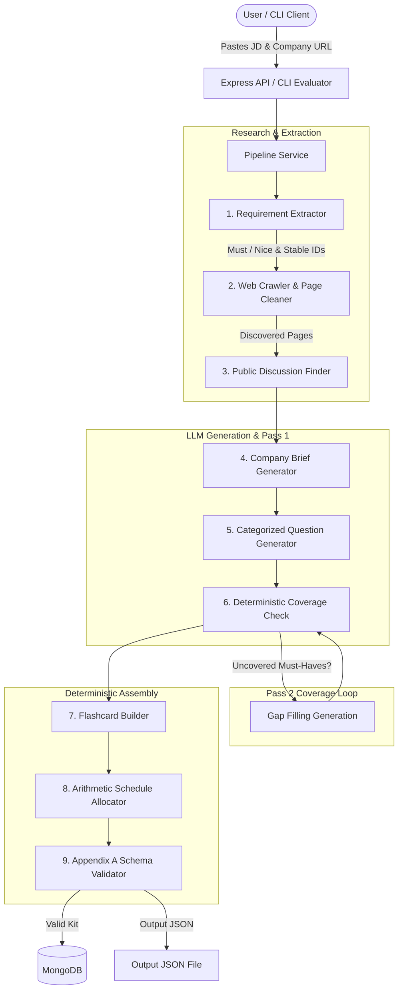

# 🚀 AI Interview Prep Kit

A production-ready full-stack application and CLI pipeline that transforms job descriptions into personalized, interactive interview preparation suites — including company briefs, role requirement matrices, categorized question banks, flashcards, and day-by-day study schedules.

Built for the **Trao Full-Stack Engineering Assessment**.

---

## 📑 Table of Contents
- [Overview & Tech Stack](#-overview--tech-stack)
- [Architecture & Flow](#-architecture--flow)
- [Quick Start & Setup](#-quick-start--setup)
- [Batch Entry Point (CLI)](#-batch-entry-point-cli)
- [LLM Provider & Model Choice](#-llm-provider--model-choice)
- [Research & Pipeline Sequencing](#-research--pipeline-sequencing)
- [Coverage Loop (The Second Pass)](#-coverage-loop-the-second-pass)
- [The Builder & State Management](#-the-builder--state-management)
- [Practice Mode & Spaced Repetition](#-practice-mode--spaced-repetition)
- [Schedule Allocation Algorithm](#-schedule-allocation-algorithm)
- [Creative Feature: Smart JD Link & Email Landing Page Suggestions](#-creative-feature-smart-jd-link--email-landing-page-suggestions)
- [Edge Cases & Failure Handling](#-edge-cases--failure-handling)
- [Design Decisions, Trade-Offs & Limitations](#-design-decisions-trade-offs--limitations)

---

## 💡 Overview & Tech Stack

| Layer | Technology | Justification |
| :--- | :--- | :--- |
| **Frontend** | **Next.js 14 (App Router) + TypeScript + Tailwind CSS** | Server & Client Components, fast App Router navigation, responsive UI, zero ESLint warnings. |
| **State Management** | **Zustand** | Lightweight, predictable client state for interactive builder reordering, inline editing, and practice sessions. |
| **Backend** | **Node.js + Express.js** | Modular REST API with clear separation of concerns (retrieval, extraction, generation, scheduling, persistence). |
| **Database** | **MongoDB + Mongoose** | Flexible document storage for deeply nested kit structures (Appendix A schema) and user session state. |
| **LLM Provider** | **Groq API (`openai/gpt-oss-120b`)** | Ultra-fast inference (< 1.5s response times), reliable JSON output mode, and free-tier access. |
| **Web Scraper** | **Node.js HTTP + Cheerio + `robots-parser`** | Lightweight, fast HTML sanitization, link discovery, and robots.txt compliance without heavy headless browser overhead. |

---

## 🏗️ Architecture & Flow



---

## ⚙️ Quick Start & Setup

### Environment Setup
Copy the `.env.example` file in the `backend/` directory:

```bash
cp backend/.env.example backend/.env
```

Ensure your `backend/.env` contains:
```env
PORT=8080
MONGODB_URI=mongodb://127.0.0.1:27017/ai-interview-prep-kit
JWT_SECRET=super-secret-jwt-key
GROQ_API_KEY=gsk_your_groq_api_key_here
LLM_PROVIDER=groq
GROQ_MODEL=openai/gpt-oss-120b
```

### Local Development

1. **Install Root & Subproject Dependencies**:
   ```bash
   npm run install-all
   ```

2. **Start Backend Server**:
   ```bash
   cd backend
   npm run dev
   ```
   *Runs on `http://localhost:8080`*

3. **Start Frontend App**:
   ```bash
   cd frontend
   npm run dev
   ```
   *Runs on `http://localhost:3000`*

---

## 🧪 Batch Entry Point (CLI)

Per **Section 9** of the assessment specification, the repository exposes a single mandatory command that executes the entire pipeline across a file of test cases without going through the web interface:

```bash
npm run evaluate -- --input <path-to-cases.json> --output <path-to-output-kits.json>
```

### Example Usage:
```bash
npm run evaluate -- --input backend/test-cases.json --output output_kits.json
```

### Batch Input Format (`<cases.json>`):
```json
[
  {
    "id": "case-01",
    "jd": "Senior Backend Engineer with 5+ years of Node.js and MongoDB...",
    "company_url": "https://posthog.com",
    "days": 5
  }
]
```

### Batch Output Format (`<kits.json>` matching Appendix B):
```json
{
  "version": "1.0",
  "generated_at": "2026-09-09T03:15:00Z",
  "kits": [
    {
      "id": "case-01",
      "status": "ok",
      "kit": { /* Appendix A compliant kit structure */ },
      "error": null
    }
  ]
}
```

---

## 🤖 LLM Provider & Model Choice

- **Provider**: **Groq API** (`https://api.groq.com/openai/v1`)
- **Model**: **`openai/gpt-oss-120b`** (with fallback to `llama-3.3-70b-versatile`)
- **Justification**:
  - **Speed**: Groq's LPU inference engine delivers JSON responses in under 1.5 seconds, making real-time kit generation responsive.
  - **Free Tier Resilience**: Free-tier rate limits (tokens per minute) are gracefully managed via custom exponential backoff utilities ([`backend/src/utils/retry.js`](file:///d:/Projects/fullstack-projects/AI%20Interview%20Prep%20Kit/backend/src/utils/retry.js)) that automatically parse Groq's retry-after headers and back off.

---

## 🔄 Research & Pipeline Sequencing

The system avoids single-prompt generation. It executes a multi-step sequence where each phase feeds structured context into the next:

1. **Requirement Extraction**: Parses the raw JD text into structured requirements with stable IDs (`r1`, `r2`...), priority (`must` vs `nice`), and kind (`technical`, `behavioural`, `domain`).
2. **Company Crawling**: Fetches the company URL, follows internal links (`/careers`, `/jobs`, `/about`, `/handbook`), strips navigation boilerplate, and cleans HTML into clean text chunks.
3. **Public Discussion Retrieval**: Queries public interview experiences and company engineering values.
4. **Company Brief Generation**: Synthesizes company mission, products, and engineering culture.
5. **Category Question Generation**: Generates targeted questions separately per requirement and interview round category (`technical`, `behavioural`, `system-design`, `company-fit`). Each question explicitly links to its requirement IDs (`requirement_ids: ["r1"]`).
6. **Flashcard Generation**: Creates question/answer study cards referencing requirement IDs.
7. **Schedule Allocation**: Arithmetically maps topics to the requested number of days.

---

## 🔁 Coverage Loop (The Second Pass)

Section 4 requires ensuring no `must-have` requirement is left uncovered:

- **Deterministic Code Decision**: Checking question coverage is performed in pure JavaScript ([`backend/src/services/coverage.js`](file:///d:/Projects/fullstack-projects/AI%20Interview%20Prep%20Kit/backend/src/services/coverage.js)), **not** by the LLM.
- **Pass Limit**: Set to `MAX_COVERAGE_PASSES = 3`. 
- **Mechanism**:
  1. Standard generation runs (Pass 1).
  2. Code checks if any `must` requirement ID is missing from all generated questions.
  3. If missing IDs exist, the system triggers a targeted **Gap Filling Pass**, generating specific questions for those missing requirement IDs.
  4. The kit tracks `coverage: { uncovered_requirement_ids: [], passes: N }`.

---

## ✏️ The Builder & State Management

Section 6 requires that editing or regenerating one section must not clobber user edits elsewhere:

- **State Representation**:
  Each item in the kit schema includes optional metadata flags:
  - `edited: true` (set when the user modifies prompt text, answer outline, or category inline).
  - `pinned: true` (set when the user explicitly locks an item).
- **Scoped Section Regeneration**:
  When a user clicks "Regenerate" on a specific category (e.g. `technical`) or section:
  1. The frontend sends the current state including edited/pinned items.
  2. The backend generates fresh candidate items for that section.
  3. The backend merges the result: **all items marked `edited: true` or `pinned: true` are strictly preserved**, while unedited generated items are refreshed.

---

## 🃏 Practice Mode & Spaced Repetition

Section 7 requires interactive practice against flashcards with confidence tracking:

- **Interactive Card Flip**: Step through cards with 3D flip animation, answer reveal, and keyboard shortcuts (`Space` to flip, `1`-`4` for rating).
- **Confidence Rating**: Users rate cards from `1` (Needs Work) to `4` (Mastered).
- **Spaced Repetition Sorting Algorithm**:
  Cards are prioritized using a weighted confidence score ($Score = 5 - Confidence$). Cards rated 1 or 2 appear earlier and more frequently in upcoming review sessions, while cards rated 4 are deprioritized until all low-confidence items are covered.

---

## 📅 Schedule Allocation Algorithm

Section 8 specifies that schedule building is **arithmetic** and must not be handed to the model:

- **Pure Code Execution**: Handled in [`backend/src/services/scheduler.js`](file:///d:/Projects/fullstack-projects/AI%20Interview%20Prep%20Kit/backend/src/services/scheduler.js).
- **Rules Enforced**:
  - `days_available` equals exact requested days.
  - Priority distribution: `must`-have technical and system-design requirements land on earlier days (Days 1..N-1), leaving lighter review for the final day.
  - Durations are strictly integer minutes (e.g., 60m, 90m, no floating numbers).
  - Every `must`-have requirement appears somewhere in the schedule.

---

## ✨ Creative Feature: Smart JD Link & Email Landing Page Suggestions

As a custom usability feature, the frontend automatically scans job description text as the user pastes or types:

- **Link & Email Detection**: Extracts explicit HTTP/HTTPS links and HR email addresses (e.g., `careers@posthog.com` or `talent@acme.io`).
- **Landing Page Normalization**: Converts raw URLs and non-generic email domains into clean landing page addresses (`https://posthog.com`, `https://acme.io`).
- **Generic Email Filter**: Filters out public mail hosts (`gmail.com`, `yahoo.com`, `outlook.com`, etc.).
- **1-Click Auto-Fill**: Renders clickable suggestion badges directly under the Company URL input field so users can populate the field with a single click.

---

## 🛡️ Edge Cases & Failure Handling

| Edge Case | Handling Strategy |
| :--- | :--- |
| **Invalid/404/Timeout URL** | Crawler catches network/HTTP errors, logs a warning, skips the unreachable site, and proceeds with JD-based research without failing the run. |
| **No Discoverable Hiring Page** | Generates an honest company brief using general domain knowledge and marks missing pages in `source.pages_used`. |
| **Two-Line Stub JD** | Requirement extractor processes stated text honestly without inventing fabricated requirements. |
| **No Public Discussion Found** | Soft fallback to role-specific interview conventions; records empty discussion snippets gracefully. |
| **Invalid JSON from LLM** | Strict JSON mode enabled (`response_format: { type: "json_object" }`) with try/catch regex JSON repair fallback. |
| **LLM Rate Limit (429 / TPM)** | Utility in [`backend/src/utils/retry.js`](file:///d:/Projects/fullstack-projects/AI%20Interview%20Prep%20Kit/backend/src/utils/retry.js) catches 429 errors, parses Groq `retry-after` header, and applies exponential backoff up to 3 retries. |
| **1-Day vs 60-Day Schedule** | Scheduler dynamically scales time buckets from 1 day up to 60 days without hardcoding fixed limits. |

---

## ⚖️ Design Decisions, Trade-Offs & Limitations

1. **Deterministic vs Generative Boundaries**:
   - *Decision*: Arithmetic schedule generation and coverage gap identification are locked in deterministic JavaScript code rather than prompted via LLM.
   - *Rationale*: Eliminates hallucinations, guarantees 100% exact day constraints, and ensures stable testable logic.

2. **Cheerio Crawling vs Headless Browser**:
   - *Decision*: Used Cheerio with Node.js `axios`/`fetch` instead of Puppeteer/Playwright.
   - *Rationale*: Faster execution (< 500ms per page), lower memory usage, and zero browser dependency setup for batch CLI runs.

3. **Known Limitations**:
   - Web pages requiring complex JavaScript single-page rendering or Cloudflare bot challenges may return clean fallback content rather than full rendered HTML.

---

## 📜 Appendix Compliance
- **Appendix A Structure**: Verified by automated structure validator ([`backend/src/services/validation.js`](file:///d:/Projects/fullstack-projects/AI%20Interview%20Prep%20Kit/backend/src/services/validation.js)).
- **Appendix B Batch Output**: Verified by CLI evaluator ([`backend/src/cli/evaluate.js`](file:///d:/Projects/fullstack-projects/AI%20Interview%20Prep%20Kit/backend/src/cli/evaluate.js)).
